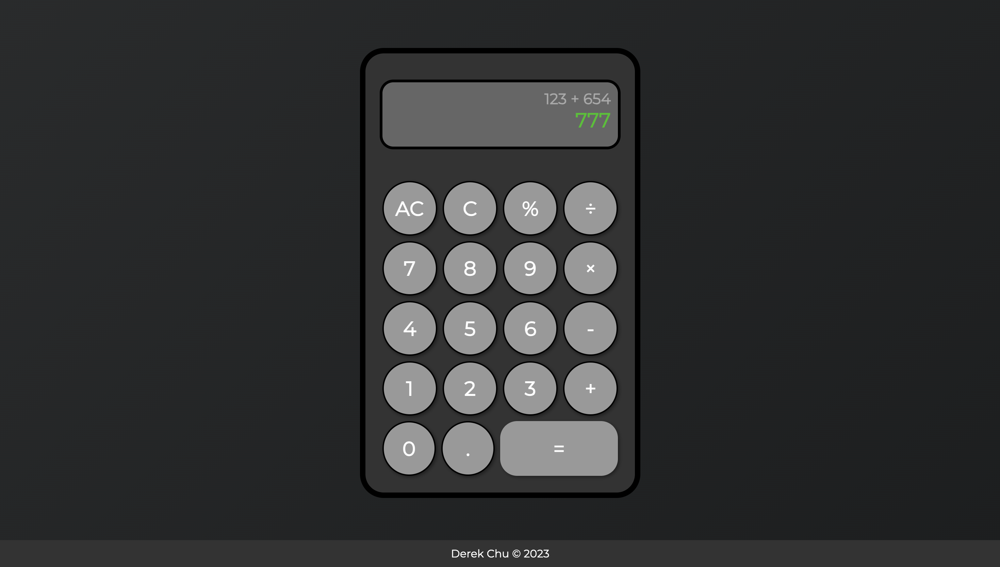

# Web Calculator
Fully functional on-screen calculator using JavaScript, HTML, and CSS (with built-in keyboard support)

## Learning Goals
* Combine HTML, CSS, and JavaScript into a cohesive project
* Practice CSS styling
* Solidify JavaScript fundamentals: DOM manipulation, event handling, debugging/testing

  

[Live Demo](https://drkchu.github.io/calculator/)

## How to use
Press the buttons as you would a regular calculator to compute  

Alternatively, use keyboard inputs to operate the calculator
* A `digit` (0 through 9) to create a number
* `+`, `-`, `*`, or `/` to select the corresponding operation
* `.` to add a decimal point
* `=` or `Enter` to calculate
* `Backspace` to go back a step
* `Escape` to clear the data
